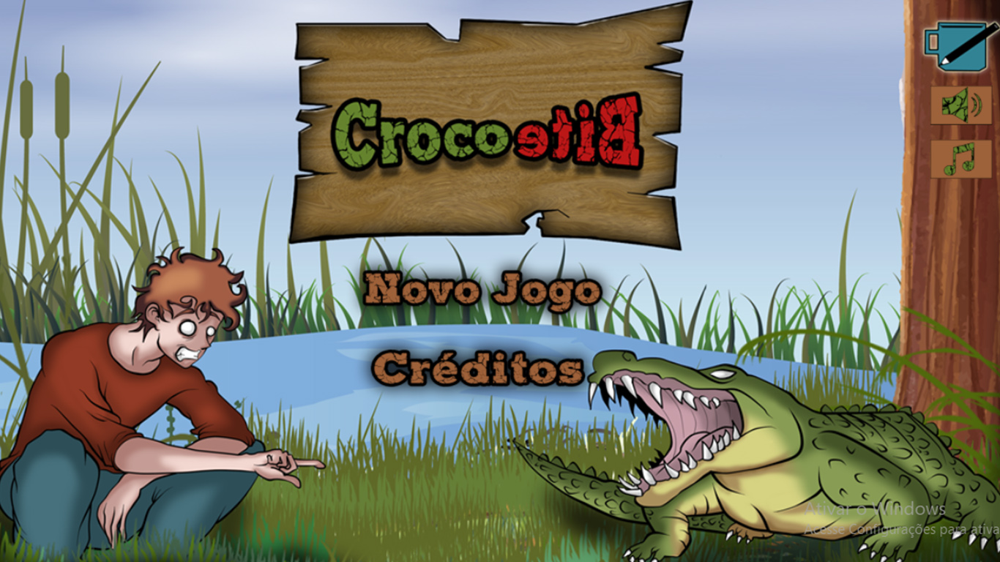
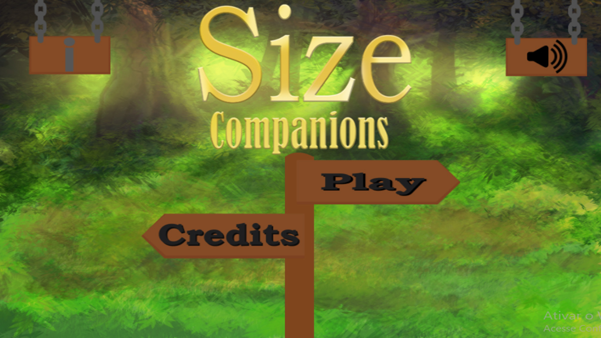

## Meu Portifolio
## Quem sou eu? Danilo, estudante de Jogos Digitais do IFRN campus de Ceará-Mirm, interessado na área de programação

### Jogos

Jogos feitos na materia de oficina com o professor Marcelo Barros

**Jogo1:** <a href="https://danilo25.github.io/CrocoBite/" target="_blank"> CrocoBite <a/>

**Descrição: Você é corajoso o suficiente para pegar mais dentes de jacaré que seu adversário?**

**Jogo2:** <a href="https://danilo25.github.io/SizeCompanions2" target="_blank"> SizeCompanions</a> 

**Descrição: Será que o companherismo dessa elfa e anã será capaz de encontrar o tesouro?**

**Jogo3:** <a href="http://raixasantos.github.io/Flamba/" target="_blank"> Flamba </a> 

**Descrição: Flamba precisa manter sua temperatura até chegar no iglu para esquentar seus moradores!!**

## Contatos
1. **E-mail:** danilo25aciole@gmail.com e danilowork25@gmail.com
2. **Instagram:** danilo_sba
