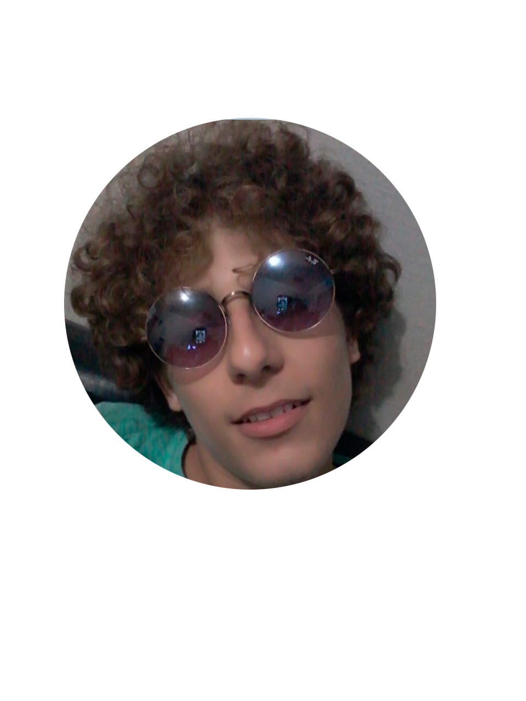

## Meu Portifolio
### Quem sou eu?
 
Danilo, estudante de Jogos Digitais do IFRN campus de Ceará-Mirm, interessado na área de programação

##Jogos

Jogos feitos na materia de oficina com o professor Marcelo Barros
********Jogo1: CrocoBite******** 
********Descrição: Você é corajoso o suficiente pra pegar mais dentes de jacaré que seu adversario?********

5. Imagem e Link para abrir outra aba (url + arquivo)

********Jogo2: SizeCompanions******** 
********Descrição: Será que o companherismo dessa elfa e ana será capaz de encontrar o tesouro?********

5. Imagem e Link para abrir outra aba (url + arquivo)

********Jogo3: Flamba******** 
********Descrição: Flamba precisa manter sua temperatura até chegar no iglu para esquentar seus moradores!!********

5. Imagem e Link para abrir outra aba (url + arquivo)

## Contatos
1. ****E-mail:**** danilo25aciole@gmail.com e danilowork25@gmail.com
2. ****Instagram:**** danilo_sba
